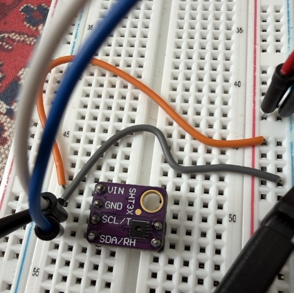

# sentinel-node

[](https://github.com/javokhirt/sentinel-node/actions/workflows/ci.yml)

A bare-metal STM32 environmental sensor node. Register-level drivers written
from datasheets and reference manuals, no vendor HAL.

This is the first node of the sensor layer for
[Rovion Controls](https://www.rovioncontrols.com/en), an agritech company I'm
building. Temperature and humidity first, then more node types, then enough
deployed hardware to train models on real greenhouse data. Ideas are cheap.
This is the part that isn't.

<p align="center">
  
</p>

## What it does

Reads temperature and humidity once a second and prints them over UART. Every
reading is checksum-verified before it's used. **1,320 readings over 22 minutes,
zero CRC failures.**

Captured off the wire with a logic analyzer:

```
6A 68 38   B4 2E 0A
│  │  │    │  │  └── CRC over B4 2E
│  │  │    └──┴───── raw RH  = 0xB42E = 46126  ->  70.38 %RH
│  │  └───────────── CRC over 6A 68
└──┴──────────────── raw T   = 0x6A68 = 27240  ->  27.74 °C
```

Six bytes, both checksums valid, last byte NAKed. See
[the bug hunt](docs/bug-hunts/0001-ack-race-on-last-byte.md) for why that last
detail took some work.

## Status

Working:

- I2C1 master driver, register level, no HAL
- SHT3x driver written from the datasheet
- CRC-8 verification on every reading
- UART output at 1 Hz
- Unit tests for the decode logic, running in CI on every push

Not done yet:

- No timeouts. Every wait loop in `platform/i2c.c` spins forever if the sensor
  stops responding. One loose wire hangs the node.
- I2C reads of 1 or 2 bytes are not implemented (see below).
- Status register command is written but never exercised.
- No radio, no RTOS, no power management.

## Hardware

| | |
|---|---|
| MCU | STM32F411RE (Nucleo-64) |
| Sensor | SHT3x breakout, generic |
| Debug | on-board ST-Link, OpenOCD |
| Analyzer | Saleae Logic |

| Nucleo | Sensor |
|---|---|
| PB8 | SCL |
| PB9 | SDA |
| 3V3 | VIN |
| GND | GND |

The breakout carries its own pull-ups and decoupling. `AD` and `AL` are left
unconnected — the board pulls `AD` low, which selects I2C address `0x44`.



## Build and flash

```sh
make            # build
make flash      # flash over OpenOCD
make size       # memory usage
make disasm     # disassemble to build/sentinel-node.dis
make -C tests   # run unit tests on the host
```

Needs `arm-none-eabi-gcc` and `openocd`.

Current footprint, 6% of flash and 3% of RAM:

```
   text    data     bss     dec     hex
  29556    1712    2360   33628    835c
```

## Layout

```
app/        main loop
drivers/    sensor drivers
platform/   MCU peripherals (I2C, UART, SysTick)
tests/      host-compiled unit tests
docs/       decisions, bug hunts, build log
tools/      OpenOCD config
```

The SHT3x driver is split in two on purpose:

- `sht3x.c` talks to the bus. Needs hardware, can't be tested off-board.
- `sht3x_decode.c` turns bytes into numbers. Pure logic, nothing beyond the
  standard library, so it compiles and runs on any machine.

That split is what makes the tests possible at all.

## Tests

Five tests over the decode logic, run by CI on every push:

- CRC against the datasheet vector, `CRC(0xBEEF) = 0x92`
- CRC init value, so an all-zero frame from a dead bus fails instead of
  decoding as a valid -45 °C
- Conversion endpoints, which catch a 65536-instead-of-65535 divisor
- A real 6-byte frame decoding to known values
- Single-bit corruption in either half being rejected

```sh
make -C tests
```

## Known limitation: short I2C reads

`i2c1_read()` only supports 3 or more bytes.

The F4's I2C peripheral needs a different sequence for 1 byte (clear ACK before
clearing ADDR) and for 2 bytes (set the POS bit), per RM0383 §18.3.3. The SHT3x
only ever reads 3 or 6 bytes, so I implemented the n > 2 path and left the
others out rather than write two sequences I couldn't test. There's a guard that
returns early instead of running the wrong one.

I'll need them when a second device goes on the bus. Most chips want a 1-byte
read for a WHO_AM_I.

## Docs

- [Build log](docs/log.md)
- [Decisions](docs/decisions/)
- [Bug hunts](docs/bug-hunts/) — a race condition on the last byte of an I2C
  read, caught by reading the reference manual before it ever ran

## Next

FreeRTOS with sensor and radio tasks, then the SX126x LoRa driver, then a
custom PCB.
