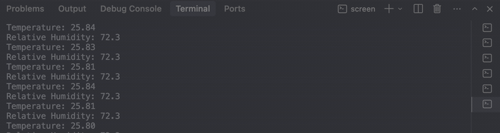
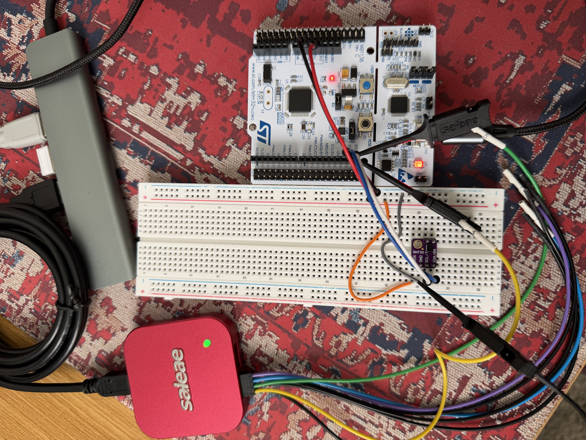
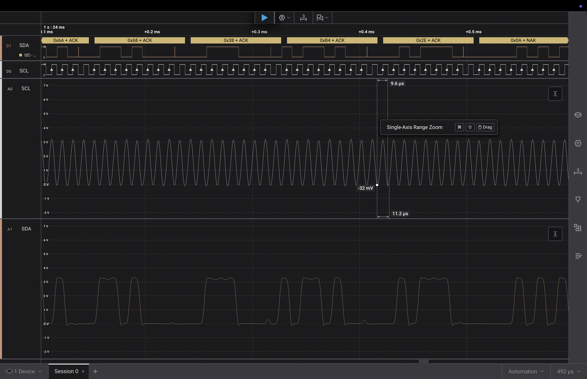

# Build log

Newest at the top.

---

## 2026-09-13 — Host tests and CI

Added unit tests and got them running on GitHub Actions.

The part that actually taught me something: I couldn't test `crc8` at all as it
was written. It was `static` inside `sht3x.c`, and `sht3x.c` includes
`stm32f4xx.h`, which plain gcc on a laptop can't compile. So wanting a test
forced me to split the file — `sht3x_decode.c` holds the CRC and the conversion
math with no hardware includes, `sht3x.c` keeps the I2C. Written up in
`decisions/0002`.

Five tests. Each one catches something specific, not just "does it run". The
all-zeros test exists because if the CRC init value were 0x00 instead of 0xFF,
a dead bus reading `00 00 00` would produce a matching checksum and decode as a
perfectly valid -45 °C. The corruption test flips one bit, which still gives a
plausible temperature — that's the exact case only a checksum can catch.

CI passed first push, which I didn't expect. Two jobs: the tests with plain
gcc, and a full firmware cross-compile with arm-none-eabi-gcc to prove it still
builds from a clean clone.

This took much longer than the driver did. Writing `test_sht3x_decode.c` was
most of it — not the code, but working out what was worth testing. Easy to write
tests that pass no matter what you break.

## 2026-09-12 — First readings

It worked on the first try. First time that's ever happened to me on a hardware
bring-up.

Flashed, opened the terminal, and there were real numbers immediately. No
garbage, no CRC loop, no silence. Temperature 25.8 °C, humidity 72.3 %RH,
updating once a second. Zero CRC errors.

What I noticed after: the temperature jitters between 25.80 and 25.84, about
±0.02 °C. Table 2 of the datasheet gives 0.04 °C repeatability for high
repeatability mode. Humidity moves 0.1 %RH against a spec of 0.08. So the noise
sits right at the level Sensirion specifies for the mode I selected — which
means the command byte is right, not just that something came back. Low or
medium repeatability would be visibly noisier. I didn't expect the noise itself
to be evidence of anything.

Captured the bus on the Saleae to see the transactions rather than infer them:

Not done: no timeouts anywhere, and I never actually ran
`sht3x_read_status()` even though I wrote it. Went straight to the measurement.

## 2026-09-10 — I2C layer rewritten, ready for the sensor driver

Spent today on `platform/i2c.c`. Went in thinking it was basically done and came
out having rewritten most of it.

Three things happened:

**The API was the wrong shape.** I'd written it around a register address
(`maddr`), copying the pattern from an MPU6050 tutorial. The SHT3x has no
registers — it's command-driven, and the measurement read is two separate
transactions with a 15 ms gap in between. Deleted `byteRead`, rewrote the other
two without `maddr`. Wrote it up in `decisions/0001`.

**The last-byte NACK was a race.** Found this by reading RM0383 §18.3.3 rather
than by testing. My loop cleared the ACK bit while the final byte was already
arriving on the wire. Fixed with the BTF approach. Full writeup in
`bug-hunts/0001` — this is the one I'd want to talk about.

**Types.** Buffers were `char`, which is signed on ARM GCC. Every byte above
0x7F would have sign-extended when I shifted it into a `uint16_t`, so my
humidity readings would have been quietly wrong. Changed to `uint8_t`. Nothing
dramatic, but it's the kind of bug that produces plausible numbers instead of
an error, which is worse.

Also read the SHT3x datasheet properly for the first time. Sections 1–3 and 5–9
are almost entirely irrelevant to the driver; §4 is the whole thing. Useful
things I pulled out:

- address 0x44 (ADDR pin low, which is what the breakout does)
- `0x2400` = single shot, high repeatability, no clock stretching
- 15 ms max measurement time at high repeatability (Table 4)
- 6 bytes back: T MSB, T LSB, CRC, RH MSB, RH LSB, CRC
- CRC-8, poly 0x31, init 0xFF, test vector CRC(0xBEEF) = 0x92
- `T = -45 + 175 * raw / 65535` and `RH = 100 * raw / 65535` — note 65535, not
  65536

Skipping clock stretching on purpose. It would let me read immediately without
the delay, but it means the sensor holds my clock line for 15 ms with no timeout
and no way out. That's fine on a desk and bad under an RTOS.

**Not done:** no timeouts anywhere. Every `while` loop in this file spins
forever if the sensor doesn't respond, so one loose wire hangs the node. There's
a TODO at the top of the file. Wanted one clean reading before adding error
paths, which I still think is the right order, but it can't stay this way.

**Next:** `drivers/sht3x.c` on top of this. Plan is to write the CRC function
first and check it against 0x92 on my laptop before any of it touches the board.

Nothing has run on hardware yet. Everything here is "compiles and I believe it
is correct," which is not the same thing.
